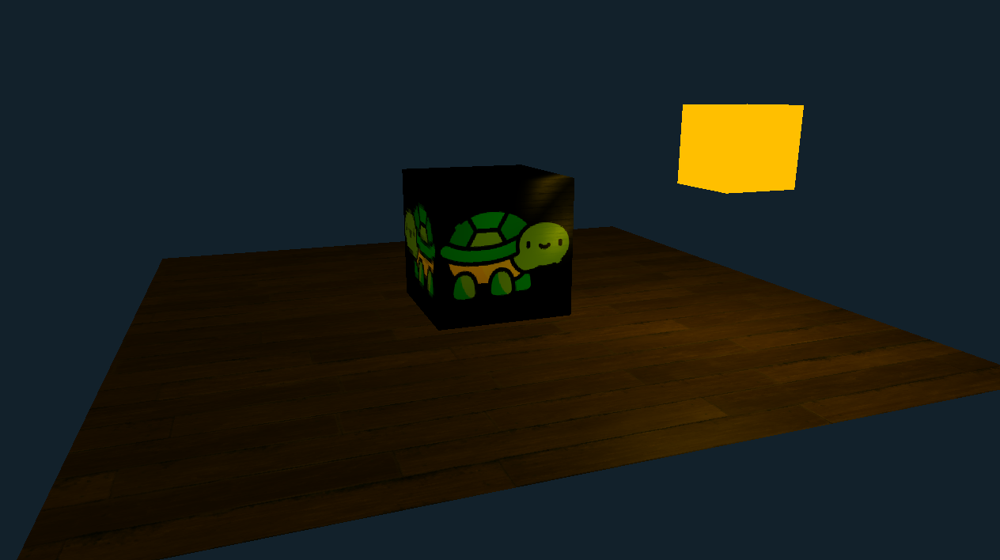

# OpenGL Project

This project is a basic game using OpenGL and C++.



## Requirements

### Required Libraries
**Important**: On Windows, it is recommended to use MSYS2 MinGW64 to provide the Unix-like environment to use `pkg-config` and other tools.

Before running the project, you must install the following libraries:

1. **GLFW3**

   - GLFW is used for creating windows with OpenGL contexts and handling input events like keyboard and mouse.
   - Install via package manager (Ubuntu):
     ```bash
     sudo apt-get install libglfw3 libglfw3-dev
     ```
   - Install via package manager (MSYS2 MinGW64):
     ```bash
     pacman -S mingw-w64-x86_64-glfw
     ```
2. **GLEW**

   - GLEW is used for managing OpenGL extensions.
   - Install via package manager (Ubuntu):
     ```bash
     sudo apt-get install libglew-dev
     ```
   - Install via package manager (MSYS2 MinGW64):
     ```bash
     pacman -S mingw-w64-x86_64-glew
     ```
3. **OpenGL**

   - OpenGL is the graphics rendering API used in this project.
   - Install via package manager (Ubuntu):
     ```bash
     sudo apt-get install libopengl-dev
     ```
   - Install via package manager (MSYS2 MinGW64):
     ```bash
     pacman -S mingw-w64-x86_64-opengl
     ```
4. **Pkg-config**

   - Pkg-config helps manage library compile and link flags.
   - Install via package manager (Ubuntu):
     ```bash
     sudo apt-get install pkg-config
     ```
   - Install via package manager (MSYS2 MinGW64):
     ```bash
     pacman -S mingw-w64-x86_64-pkg-config
     ```

### Additional Tools

- **CMake** (for building the project)

  - Install via package manager (Ubuntu):
    ```bash
    sudo apt-get install cmake
    ```
  - Install via package manager (MSYS2 MinGW64):
    ```bash
    pacman -S mingw-w64-x86_64-cmake
    ```

## Setup and Build

### Step 1: Clone the repository

Clone this repository to your local machine:

```bash
git clone https://github.com/ColeChiodo/opengl_game.git
cd opengl_game
```

### Step 2: Run the build script

The project comes with a build.sh script that will handle the configuration and compilation of the project using CMake.

Make the script executable:

```bash
chmod +x build.sh
```

Now, run the script with the appropriate flags:

```bash
./build.sh [-l]/[-w] [-d] [-r]
```

Available flags:

- `-w` : Builds for Windows.
- `-l` : Builds for Ubuntu.
- `-d` : Delete the contents of the build directory before building the project.
- `-r` : Run the program after building it.

Alernatively, if the project is already built, run the program using:

(Ubuntu):
```bash
cd ./build
./OpenGLProject
```
(Windows):
```bash
cd ./build
./OpenGLProject.exe
```
